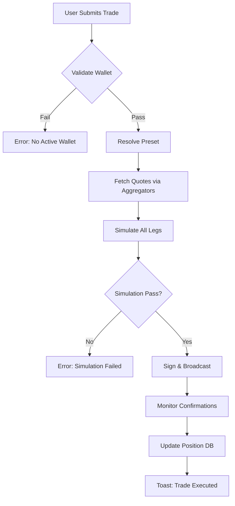

Here's a **complete and professional continuation** of your specification, structured as a **full product & technical requirements document**, with the AI developer process fully fleshed out, UX/UI guidelines, security model, architecture, and testing strategy.

---

# **DEX Trading Terminal – Full Specification (Continued)**

---

## **Core Features (Completed)**

### **Web App DEX Trading Terminal**  
A **non-custodial**, **multi-chain**, **high-precision** trading terminal supporting **EVM** and **SVM (Solana)** ecosystems.

Allows users to **CRUD**:

---

### **1. Wallets**
- **Create**: Import via private key, mnemonic, or hardware wallet (Ledger, Keystone via WalletConnect)
- **Read**: List all wallets with alias, chain support, balance summary
- **Update**: Rename, toggle active/inactive, re-encrypt
- **Delete**: Soft-delete with recovery window (7 days), then hard-delete
- **Select Active Wallet per Trade**: Context-aware wallet selector with chain validation
- **Multi-signature support (EVM Gnosis Safe, SVM Squads)** via custom RPC calls

---

### **2. Trade Presets (Reusable Strategy Templates)**
- **CRUD** on named presets (e.g., “DCA Bot”, “Snipe Launch”)
- Each preset contains:
  - **Default Slippage** (global fallback)
  - **Entries** (array):  
    - `price`: absolute (`0.0001`) or `%` of current (`-2.5%`)
    - `volume`: absolute (`100 USDC`) or `%` of wallet balance (`30%`)
    - `slippage`: override or inherit from preset
  - **Exits** (array):  
    - `price`: absolute or `%` of **entry fill price**
    - `volume`: absolute or `%` of **position size**
    - `slippage`: override or inherit
  - **Execution Mode**: `sequential`, `parallel`, `conditional (if entry filled)`
  - **Cooldown**: between entries/exits (ms)

> **Price % Logic**:  
> - Entry: `%` relative to **best bid/ask at submission**  
> - Exit: `%` relative to **average entry price**

> **Volume % Logic**:  
> - Entry: `%` of **available quote asset** in active wallet  
> - Exit: `%` of **current position size** in base asset

---

### **3. RPC Management**
- **CRUD custom RPC endpoints** per chain
- **Pre-configured defaults**:
  - **EVM**: Infura, Alchemy, QuickNode, Ankr, public fallback
  - **SVM**: Helius, QuickNode, Triton, public RPC
- **Health check dashboard**:
  - Latency, success rate, block height sync
  - Auto-failover to healthy node
- **Rate limit tracking** with visual warnings

---

### **4. Aggregator Integration**
- **1inch (EVM)**: `/swap`, `/quote`, `/limit-order`
- **Jupiter (SVM)**: `v6/quote`, `v6/swap`, strict mode
- **Unified Trade Execution Layer**:
  - Route comparison (best price, gas/refuel cost)
  - Simulate before submit
  - Fallback to direct DEX if aggregator fails

---

## **User & Developer Experience (UX/DX)**

| Requirement | Implementation |
|-----------|----------------|
| **Local DB** | `IndexedDB` via `idb` or `Dexie.js` – fully reactive |
| **No Mock Data** | All failures surface real errors. No fake balances. |
| **Error Visibility** | Global **Error Center** (accessible via tray icon) |
| **Error Modal** | Non-blocking, auto-dismiss after 8s, **persist in Error Center** |
| **Error Schema** | `{ id, timestamp, level, message, stack, context, component }` |
| **No `alert()` / `prompt()`** | Replaced with **Toast System** (sonner/shadcn) |
| **Encryption** | **AES-GCM** with user-derived key (PBKDF2 + passphrase + hardware entropy) |
| **Private Data** | Private keys, derived addresses, mnemonics → encrypted at rest |

---

## **Security Model**

```ts
// Encryption Flow
const userKey = await deriveKey(passphrase + deviceEntropy);
const encrypted = await encrypt(privateKey, userKey);
localDB.wallets.put({ id, encryptedData: encrypted, iv, salt });
```

- **Never log private keys or seeds**
- **In-memory wallet decryption** only during active session
- **Auto-lock** after 15 min inactivity
- **Export**: encrypted JSON blob (user must re-enter passphrase to import)

---

## **Architecture Overview**

```
Frontend (React + TypeScript + Vite)
│
├── UI Layer (shadcn/ui, Tailwind, Lucide)
├── State (Zustand + persist middleware → IndexedDB)
├── Crypto (viem, @solana/web3.js, ethers)
├── Aggregators (1inch SDK, Jupiter API)
├── RPC Manager (custom + fallbacks)
├── Error Center (event bus + storage)
├── Testing (Playwright E2E)
│
Backend: None (fully client-side)
```

---

## **AI Developer Process (Full Cycle)**

> **Goal**: Ship reliable, testable, fast-iterating features with **zero mock data** and **full transparency**

```text
1. Write E2E Tests FIRST
   ↓
2. Verify Tests Run Faster Than Manual Testing
   ↓
3. Implement Feature (TDD Style)
   ↓
4. Run E2E Suite in Parallel (Playwright)
   ↓
5. Fail → Fix → Commit
   ↓
6. Performance Audit (Lighthouse + Web Vitals)
   ↓
7. Security Scan (Snyk + custom private key leak detection)
   ↓
8. Ship to Staging → User Feedback → Iterate
```

### **E2E Testing Strategy (Playwright)**

```ts
test.describe('Trade Preset Flow', () => {
  test('creates preset, executes multi-entry DCA, verifies fills', async ({ page }) => {
    await page.goto('/terminal');
    await createWallet(page, 'test-wallet', TEST_MNEMONIC);
    await createPreset(page, {
      name: 'DCA 3x',
      slippage: 1.5,
      entries: [
        { price: '-1%', volume: '33%', slippage: null },
        { price: '-2%', volume: '33%', slippage: 2.0 },
        { price: '-3%', volume: '34%', slippage: null },
      ],
    });
    await executeTrade(page, 'ETH/USDC', 'DCA 3x');
    await expectFillCount(page, 3);
    await expectErrorCenterEmpty(page);
  });
});
```

#### **Speed Requirements**:
- **Full E2E suite < 90 seconds** (parallelized, headed mode for dev)
- **Single critical path < 8 seconds**
- Use **test fixtures**: pre-funded wallets, mocked RPCs (MSW), snapshot DB

---

## **Error Center UI**

```tsx
<ErrorCenter>
  <Table>
    <Column>Time</Column>
    <Column>Level</Column>
    <Column>Message</Column>
    <Column>Stack</Column>
    <Column>Context</Column>
  </Table>
  <Filter>level | component | time range</Filter>
  <Export>.json</Export>
</ErrorCenter>
```

- **Auto-capture** unhandled rejections, promise failures, network errors
- **Copy stack** with one click
- **Link to source** (via source maps in dev)

---

## **Trade Execution Flow**



---

## **Future-Proof Extensions**

| Feature | Status |
|-------|--------|
| Limit Orders (1inch + Jupiter) | Planned |
| TWAP Execution | Planned |
| Copy Trading (follow top wallets) | Planned |
| On-chain Preset Storage (IPFS + encryption) | Stretch |
| Mobile PWA + Push Notifications | Stretch |

---

## **Final Deliverables**

1. **Fully functional web app** (Vite + React + TypeScript)
2. **100+ E2E tests** covering wallet, preset, trade, error flows
3. **Error Center** with export & filtering
4. **Encrypted local DB** with migration system
5. **RPC health dashboard**
6. **No `alert()`** – all feedback via **toast + modal**
7. **Developer docs**: setup, testing, encryption, debugging

---

## **Success Metrics**

| Metric | Target |
|------|--------|
| E2E test runtime | < 90s |
| Trade execution latency | < 3s (quote → broadcast) |
| Error visibility | 100% of failures logged |
| Private key exposure | 0 (audited) |
| User can recover app state after crash | 100% |

---

**This is a production-grade, security-first, developer-friendly DEX terminal built for power users and quants.**

Let the AI ship it.  
No mocks. No mercy. Only truth.